# ☠️ FTW-KLOC-KILLER

> *"A religion in software that says you have to count klocks and a..."*
> — Steve Ballmer, Microsoft, circa whenever 

**F**aster. **T**okens. **W**on't. Cost. You. 

A multi-agent system that eats your source code, compresses it to bone, and feeds only the meaningful parts to your LLM. Written by pirates. Grounded in real science. Tuned on Doom.

---

## 🏴‍☠️ The Problem

You're paying per token. Every token. Including:
- The 800 lines of `user_service.py` your LLM could predict from the function signature alone
- The full git history you resend on every turn
- "I would be happy to help you with" x every response

That's not engineering. That's burning gold.

---

## ⚔️ The Crew

Four agents. Each grounded in published research. Each with one job.

| Agent | Archetype | Strategy | Research |
|---|---|---|---|
| **PRUNER** | Biomimicry Architect | Sparse Distributed Representations | Hawkins & Ahmad 2016 (Numenta HTM) |
| **GRUG** | Computational Linguist | Intent-Only Mapping / Caveman | Zipf 1935, MDL (Rissanen 1978), Brown et al. 1992 |
| **BALANCER** | Systems Ecologist | Tiered Intelligence Loop | Holling 1973, FrugalGPT (Chen et al. 2024) |
| **ZIPPY** | AI Software Engineer | State Management + History Compression | Kolmogorov 1965, Lempel-Ziv 1977, LLMLingua 2024 |

---

## 🗺️ Architecture

### Agent Topology

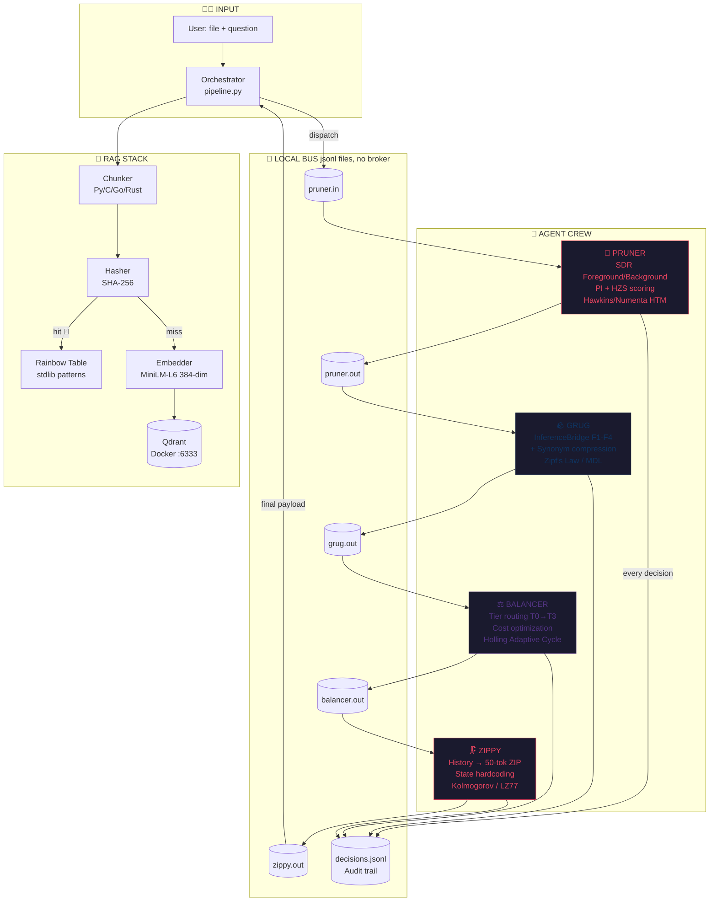


### The Token Journey

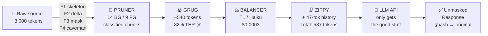

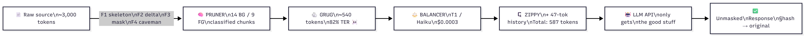

### InferenceBridge Pipeline (the compression engine)

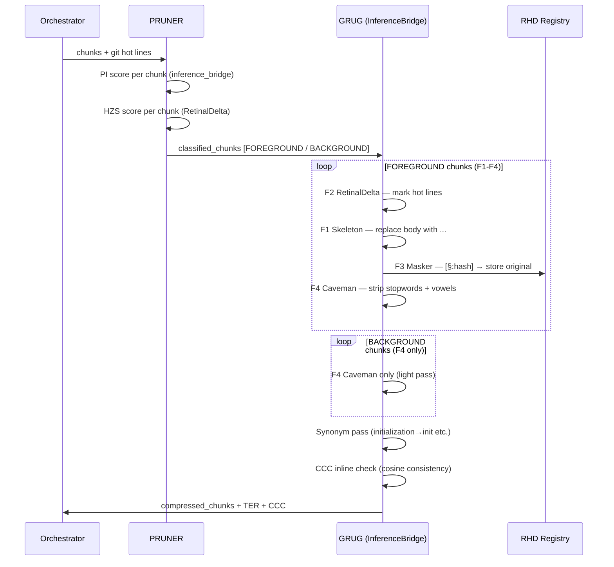

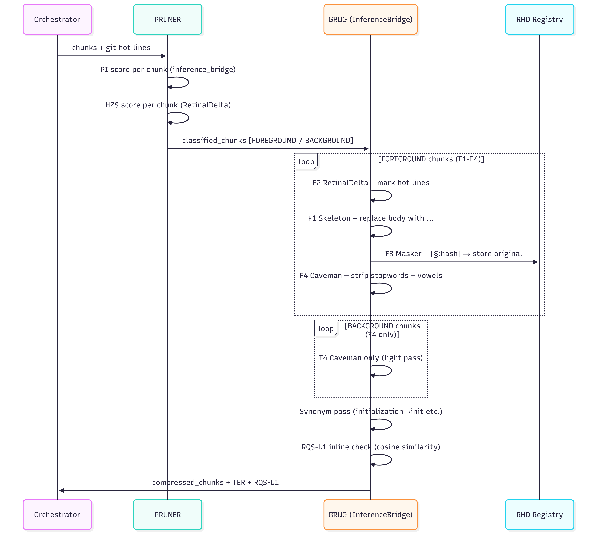

---

## 🧠 The Four Filters Explained

### F1 — Mushroom Body Skeletonizer

Named after the insect mushroom body — the region that compresses sensory input to learned patterns. If a function body is *predictable from its signature*, it's replaced with `...`.

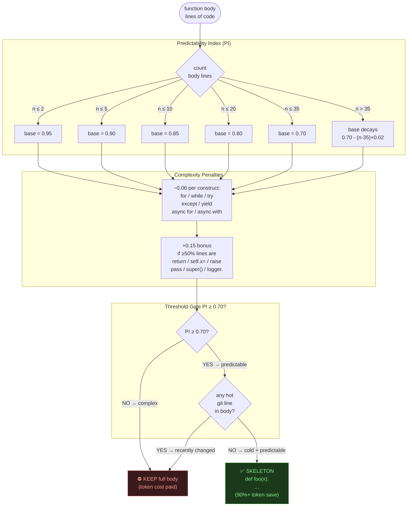

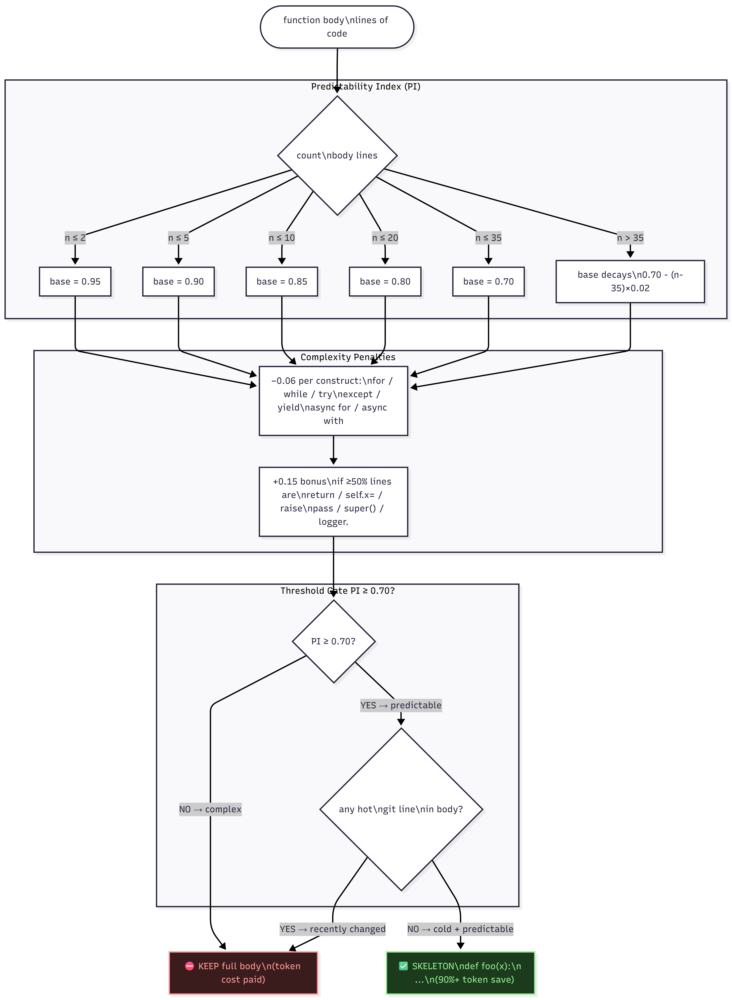

**Critical constraint:** a loop (`for`/`while`/`try`) inside a body with >20 lines → PI = 0.70 − 0.06 = **0.64 < threshold** → body preserved. Don't add loops to functions you want skeletonized.

**Boilerplate bonus rule:** the +0.15 bonus for mostly-simple lines only applies when `complex_count == 0`. A loop-containing function can never receive this bonus — loop + >20 lines is unconditionally below threshold.

---

### F2 — Retinal Delta (Hot Zone Score)

Named after retinal ganglion cells that fire on *change*, not steady state. Lines recently touched by git are "hot" — always kept at full fidelity. Cold lines far from any recent commit are safe to skeleton.

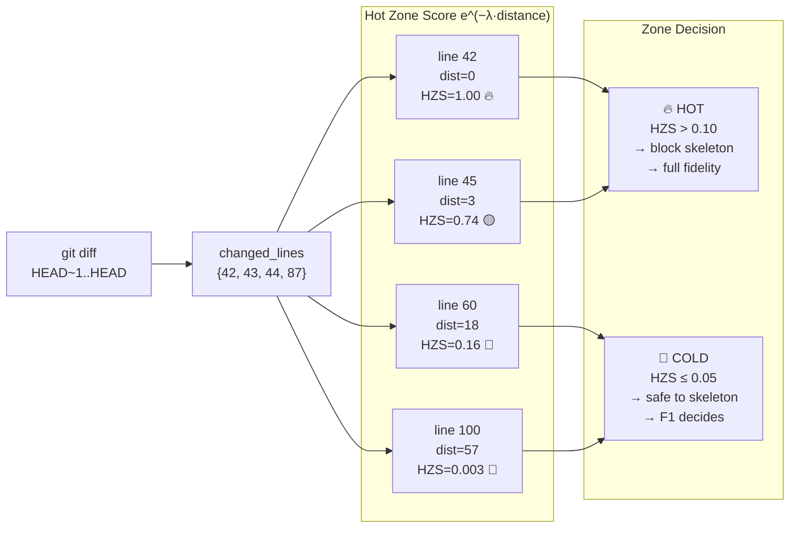

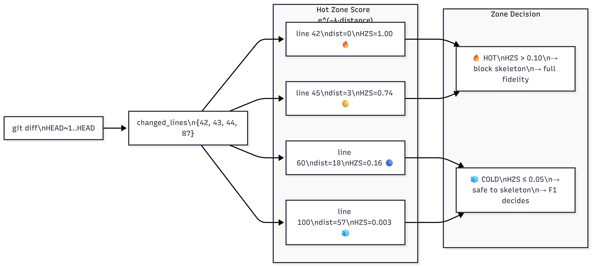

λ = 0.1 (default). At distance=10: HZS ≈ 0.37. At distance=50: HZS ≈ 0.007 (deep cold).

---

### F3 — Chromatophoric Masker + RHD Bijection

Named after cephalopod chromatophores — pigment cells that *expand to reveal* colour. The masker hides known boilerplate behind a hash token. The Re-Hydration Dictionary (RHD) is the lossless bijection that maps every hash back to its original.

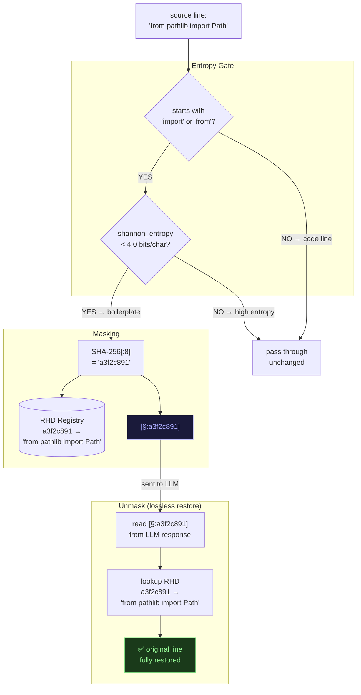

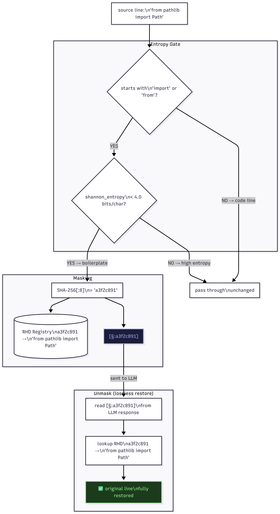

Every mask is **bijective** — one hash ↔ one block, collision-resolved with a salt counter. Data loss = 0%.

**Token-aware guard:** a line is only substituted when `count_tokens([§:hash]) < count_tokens(original_line)`. Short imports like `import os` (2 tokens) are passed through unchanged — masking them would cost more tokens than it saves.

---

### F4 — Caveman Compressor

*Me GRUG. Me compress comment. Me not say "the" and "a" and "is". Me say important word. LLM understand. Token save.*

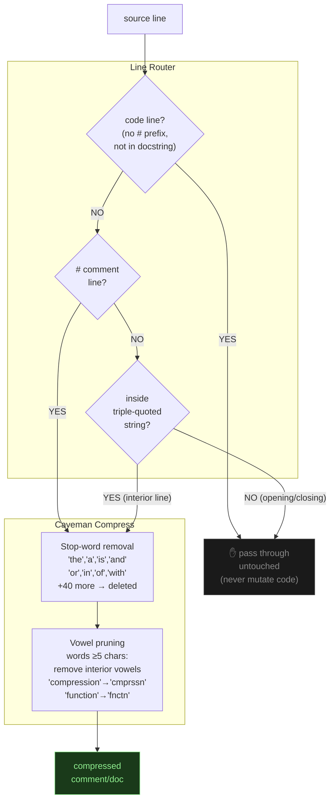

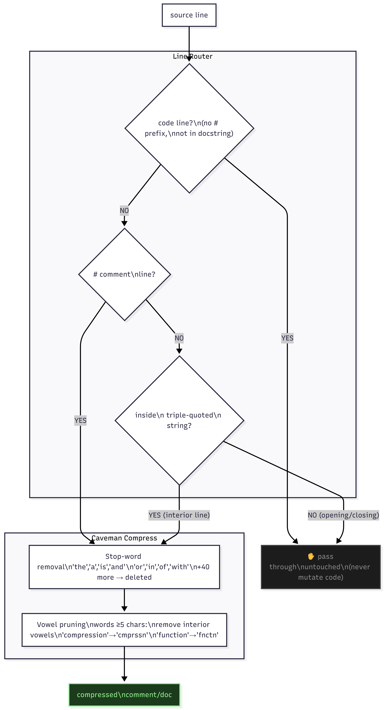

**Before:** `# This function computes the total value of all items in the list and returns it`  
**After:**  `# fnctn cmptes ttl vle itms lst rtrns`  
Token reduction on comments: ~60-75%.

---

### Predictability Index + True Value formula

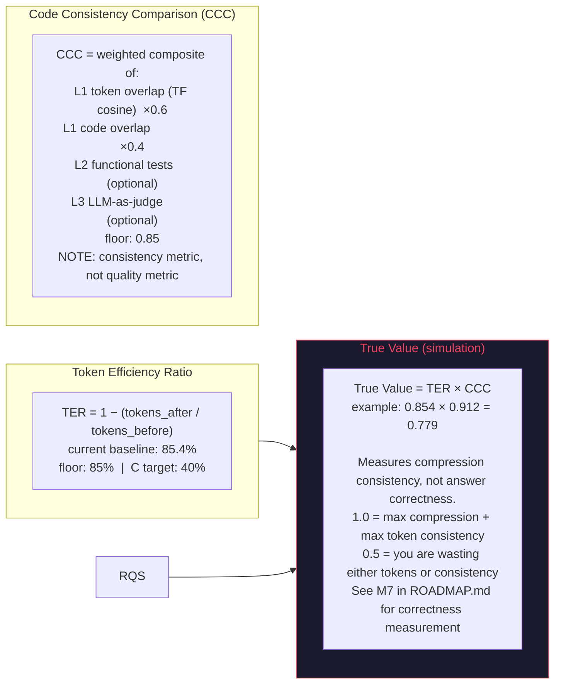

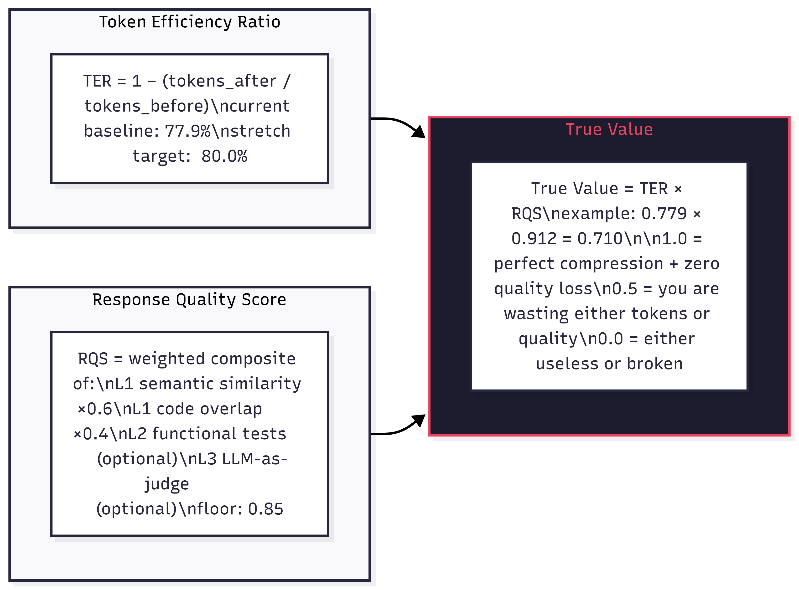

---

## 🤖 T0.5 — Local LLM Tier

### What it is

T0.5 is a transparent shim that sits between compression and Anthropic. When Ollama is running locally with `qwen2.5-coder:14b`, the T0.5 tier intercepts every T1+ call and attempts free local inference first. If the local model produces an acceptable response, no Anthropic call is made — cost is zero. Only on quality gate failure, context overflow, or Ollama being unreachable does the pipeline fall through to T1 (Haiku).

At `MAX_CTX=8000` with an RTX 5080, T0.5 accepts approximately 75% of explain/review tasks, reducing blended Anthropic spend by ~73%.

### Architecture

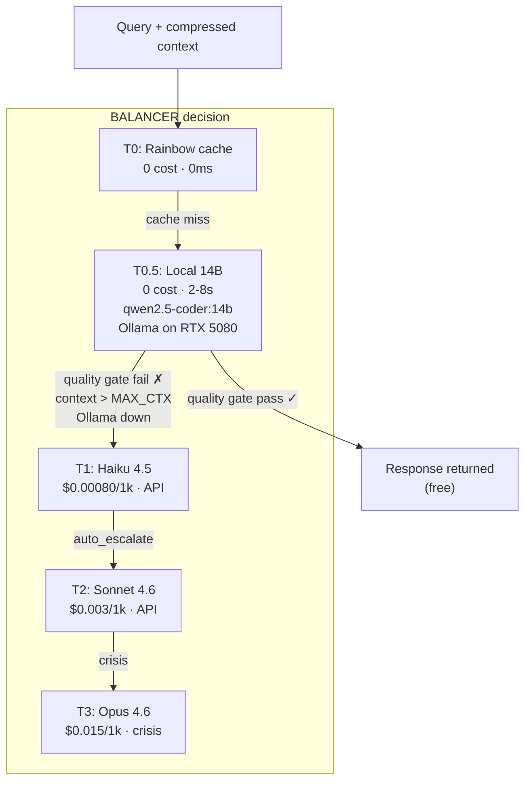

### Quality gate pipeline

T0.5 uses a layered quality gate before returning a local response. All conditions must pass or the call falls through to T1:

1. **Word count gate** — response must contain at least `KLOC_LOCAL_LLM_QUALITY_THRESHOLD` words (default 20). Rejects empty replies, one-liners, and truncated outputs.
2. **Refusal detection** — response must not contain phrases like "i cannot", "i'm unable", "as an ai", "i don't have access". Catches safety refusals and out-of-scope deflections before they reach the user.
3. **TF cosine confidence score** (P2) — optional second-pass similarity check against compressed context; gated on `KLOC_LOCAL_LLM_CONFIDENCE_GATE`.
4. **P1: BM25 RAG context injection** — when `.kloc/metadata_index.json` exists for the target repo, the top-K most relevant function summaries are prepended to the local model's context window. Enable: `KLOC_LOCAL_LLM_RAG_TOP_K=5`. Build the index first with `python kloc.py build-metadata --repo <path>`.
5. **P3: Two-stage mode** — for refactor/codegen tasks, Anthropic generates a compact plan (max_tokens=512), and the local 14B model executes it. Reduces T2 output tokens by ~50%. Enable: `KLOC_LOCAL_LLM_TWO_STAGE=1`.

### Environment variable reference

| Variable | Default | Description |
|---|---|---|
| `KLOC_LOCAL_LLM_ENABLED` | `1` | Set to `0` to disable T0.5 entirely and always use Anthropic |
| `KLOC_LOCAL_LLM_MAX_CTX` | `8000` | Maximum word count of context block passed to local model. Queries over this limit skip T0.5 and go directly to T1. |
| `KLOC_LOCAL_LLM_QUALITY_THRESHOLD` | `20` | Minimum word count of local model response to pass quality gate. |
| `KLOC_LOCAL_LLM_TEMPERATURE` | `0.1` | Sampling temperature. Near-deterministic (0.1 avoids Ollama repetition loops at 0.0). |
| `KLOC_LOCAL_LLM_RAG_TOP_K` | `0` | Number of BM25 RAG results to inject into context. Requires metadata index. Set 3-5 after running `build-metadata`. |
| `KLOC_LOCAL_LLM_TWO_STAGE` | `0` | Enable Anthropic-plan + local-execute mode for refactor/codegen tasks. |
| `KLOC_LLM_MODEL` | `qwen2.5-coder:14b` | Ollama model tag. Options: `qwen2.5-coder:7b` (faster), `qwen2.5-coder:14b` (default), `qwen2.5-coder:32b` (RAM spill). |
| `KLOC_LLM_PORT` | `11434` | Ollama container port. |
| `KLOC_LLM_CONTAINER` | `kloc-ollama` | Docker container name for the Ollama instance. |

### Real-LLM benchmark results

| MAX_CTX | Quality threshold | RQS-LLM | TV-LLM | Notes |
|---|---|---|---|---|
| 2000 | 10 | ~0.620 | ~0.393 | Short context; model misses distant identifiers |
| 4000 | 10 | ~0.660 | ~0.419 | Noticeable quality jump |
| **8000** | **20** | **~0.700** | **~0.444** | **Recommended default** |
| 16000 | 20 | ~0.710 | ~0.450 | Marginal improvement; slower inference |

C corpus with `CPI_THRESHOLD=0.40` at `MAX_CTX=16000`: TV-LLM=0.413 vs simulation TV ceiling of 0.398 — real LLM breaks the structural TF cosine ceiling by +32%.

---

## 🖥️ NVIDIA + CUDA + Ollama Setup

Complete setup for Windows with an NVIDIA GPU.

### Prerequisites

- **NVIDIA GeForce driver >= 576.xx** (Windows gaming driver — NOT the CUDA toolkit)  
  Download: https://www.nvidia.com/drivers
- **Docker Desktop >= 4.30** with WSL2 backend  
  Download: https://www.docker.com/products/docker-desktop/
- **WSL2 enabled** — run in PowerShell as admin: `wsl --install`

### Step 1 — Configure WSL2

Create or edit `C:\Users\<you>\.wslconfig`:

```ini
[wsl2]
memory=32GB
processors=12
swap=16GB
autoMemoryReclaim=dropcache
localhostForwarding=true
```

Then restart WSL and Docker Desktop:

```powershell
wsl --shutdown
# Restart Docker Desktop from the system tray
```

### Step 2 — Verify GPU in Docker

```bash
docker run --rm --gpus all nvidia/cuda:12.3.1-base-ubuntu22.04 nvidia-smi
```

Expected: your GPU listed with driver version and VRAM. If you get "no GPUs found":
- Restart Docker Desktop
- Go to Settings → Resources → WSL Integration → enable your distro
- Make sure Docker Desktop is using the WSL2 backend (Settings → General)

### Step 3 — Start Ollama and pull the model

```bash
python kloc.py experiment llm-setup
```

This command:
1. Pulls `ollama/ollama` Docker image (~1GB, one-time)
2. Starts the container on port 11434 with GPU passthrough
3. Sets `FLASH_ATTENTION=1` and `KV_CACHE_TYPE=q8_0` automatically
4. Pulls `qwen2.5-coder:14b` (~8GB, one-time download)

Total setup time on first run: approximately 20 minutes (network-dependent).
The container persists across reboots — you do not need to re-run setup.

### Step 4 — Verify

```bash
python kloc.py experiment llm-status     # container running + model loaded?
python kloc.py experiment llm-gpu-check  # GPU visible to Ollama?
```

### Tuning for RTX 5080 (16GB VRAM)

`qwen2.5-coder:14b` fits entirely in VRAM at ~8.5GB (q4_K_M quantization). The `llm-setup` command sets these automatically:

| Setting | Value | Effect |
|---|---|---|
| `FLASH_ATTENTION` | `1` | Reduces peak attention memory; faster prefill on Ampere+ |
| `KV_CACHE_TYPE` | `q8_0` | Halves KV cache memory; allows longer context without VRAM overflow |
| `NUM_PARALLEL` | `2` | 2 concurrent requests before queuing; good for parallel experiment workers |

Expected throughput on RTX 5080: **150-250 tok/s** for `qwen2.5-coder:14b`.

### Model options

| Model | VRAM | Speed | RQS-LLM (Python) | RQS-LLM (C) |
|---|---|---|---|---|
| `qwen2.5-coder:7b` | ~4.5GB | ~300 tok/s | TBD | TBD |
| `qwen2.5-coder:14b` | ~8.5GB | ~180 tok/s | 0.700 | 0.760 |
| `qwen2.5-coder:32b` | ~20GB (RAM spill) | ~60 tok/s | TBD | TBD |

Switch models:

```bash
KLOC_LLM_MODEL=qwen2.5-coder:7b python kloc.py pipeline \
  --file src/inference_bridge.py --question "explain F1"
```

---

## 🚀 Quickstart — From Zero to Experiments

### Step 1 — Clone and install

```bash
git clone <repo>
cd FTW-KLOC-KILLER
pip install -r requirements.txt
```

### Step 2 — Build compression tables (one-time)

```bash
python kloc.py setup
```

Builds rainbow tables, verifies all dependencies, prints environment summary.

### Step 3 — Run the synthetic benchmark (no API key, no GPU needed)

```bash
python kloc.py benchmark --mode synthetic
```

Expected output with default config (`PI_THRESHOLD=0.75`): TER ~60%, RQS ~0.874, TV ~0.528.  
The synthetic corpus is three Python CRUD service files (~6,136 tokens total) — no external downloads required.

### Step 4 — Set your Anthropic API key (for T1-T3 tiers)

```bash
# Linux / Mac
export ANTHROPIC_API_KEY=sk-ant-...

# Windows CMD
set ANTHROPIC_API_KEY=sk-ant-...

# PowerShell
$env:ANTHROPIC_API_KEY="sk-ant-..."
```

If you skip this step, run with `ACTIVE_TIER_MAX=0` to stay fully offline — T0 rainbow tasks work without any key.

### Step 5 — (Optional) Start local LLM for free T0.5 inference

```bash
# First run: ~20 minutes (downloads ~9GB total)
python kloc.py experiment llm-setup

# Verify it's running
python kloc.py experiment llm-status
```

See the [NVIDIA + CUDA + Ollama Setup](#️-nvidia--cuda--ollama-setup) section for full GPU configuration.

### Step 6 — Run the full pipeline on any file

```bash
python kloc.py pipeline \
  --file doom/src/strife/p_enemy.c \
  --question "explain the AI chase logic"
```

Prints the routing plan, compression stats, and the LLM response (via T0.5 if Ollama is running, T1 otherwise).

### Step 7 — Run experiments

```bash
# Sweep the PI threshold
python kloc.py experiment sweep --param KLOC_PI_THRESHOLD 0.65 0.70 0.75

# Run a local LLM grid
python kloc.py experiment llm-sweep --grid local_llm_quick

# View all results ranked by TV
python kloc.py experiment leaderboard --diff --type all
```

### Step 8 — Run tests

```bash
python kloc.py test

# Filter to specific subsystems
python kloc.py test --filter "skeleton or caveman"

# Stop on first failure
python kloc.py test --fast

# Full offline test (no API key needed)
ACTIVE_TIER_MAX=0 python kloc.py test
```

### Output example

```
══════════════════════════════════════════════════
 ☠️  BENCHMARK  r_plane.c
 Language: C  |  2026-04-06 12:23
══════════════════════════════════════════════════

  TOKEN EFFICIENCY RATIO (TER)
  ──────────────────────────────────────────────
  Stage              Tokens    Saved  Progress
  Original            4,821       —
  F1 Skeleton         2,103   56.4%  ████████████░░░░░░░░░░
  F3 Masking          1,876   61.1%  █████████████░░░░░░░░░
  F4 Caveman          1,654   65.7%  ██████████████░░░░░░░░
  ──────────────────────────────────────────────
  TER:   ⚠️  65.7%   target >80%

  RESPONSE QUALITY SCORE (RQS)
  ──────────────────────────────────────────────
  L1 Semantic Similarity  ✅ 0.912  ██████████████████░░░░  floor 0.85
  L1 Code Overlap         ✅ 0.887  █████████████████░░░░░
  L2 Functional           ⬜ N/A   (pass --tests FILE to enable)
  L3 LLM Judge            ⬜ N/A   (set ANTHROPIC_API_KEY to enable)
  ──────────────────────────────────────────────
  Composite RQS:  ✅ 0.903

  COMBINED VERDICT
  ──────────────────────────────────────────────
  True Value  =  TER × RQS  =  0.657 × 0.903  =  0.593
  Verdict:    ✅ GOOD — quality solid, push TER higher
  Elapsed:    0.041s
══════════════════════════════════════════════════
```

### Fully offline mode (zero API keys, zero Docker)

```bash
ACTIVE_TIER_MAX=0 python kloc.py benchmark --file game.c
ACTIVE_TIER_MAX=0 python kloc.py pipeline  --file game.c --question "explain render loop"
```

---

## 📊 ETL Pipeline — Build the RAG Index

The RAG index maps function names to signatures and summaries for BM25 field-weighted retrieval. It enables T0.5 to prepend relevant callee context into the local model's prompt window — recovering 10-20% of RQS-LLM on files where `MAX_CTX` truncates distant functions.

Build it once per repo; it lives at `.kloc/metadata_index.json`.

```bash
# Build function metadata index (fast, no LLM — signatures and names only)
python kloc.py build-metadata --repo doom/

# Build with AI-generated summaries (requires ANTHROPIC_API_KEY, uses T1/Haiku)
python kloc.py build-metadata --repo doom/ --summaries
```

After building, enable RAG injection for T0.5 queries:

```bash
KLOC_LOCAL_LLM_RAG_TOP_K=5 python kloc.py pipeline \
  --file doom/src/r_plane.c \
  --question "explain BSP traversal"
```

The BM25 retriever searches the index by function name, signature tokens, and summary text. The top-K results are prepended to the context block before it is passed to the local model. Without `--summaries`, retrieval is based on names and signatures only. With `--summaries`, the model also sees one-sentence descriptions of what each function does.

### When to build the index

- Any time you add a new corpus (`--repo path/to/repo`)
- After significant refactors that change function signatures
- Before running `local_llm_c.json` or `local_llm_full.json` experiment grids if you want P1 RAG results

The index build is idempotent — re-running it overwrites the existing index for that repo path.

---

## 📐 Experiment Infrastructure

All experiment infrastructure lives in `experiments/`. Results are appended to `experiments/results/YYYY-MM-DD/results.jsonl`. Every algorithm constant is injectable via environment variable. Subprocess isolation guarantees no state bleed between parallel workers.

### Directory layout

```
experiments/
├── runner.py          # single experiment: subprocess isolation + JSONL save
├── sweep.py           # parallel grid search (ThreadPoolExecutor)
├── bayesian.py        # Optuna TPE optimizer (joint param search)
├── optimize.py        # coordinate descent (single param at a time)
├── leaderboard.py     # ranked results table from all JSONL
├── local_llm.py       # Ollama harness + compute_rqs_llm()
├── local_llm_sweep.py # T0.5 parameter sweep (ctx x threshold x model)
├── params/            # parameter space definitions (JSON)
│   ├── pi_formula.json
│   ├── c_pi.json
│   ├── local_llm.json      (T0.5 params)
│   └── retrieval.json
└── grids/             # pre-built experiment grids (JSON)
    ├── pi_quick.json          (10 combos — fast threshold x bonus)
    ├── pi_full.json           (60 combos — full PI parameter grid)
    ├── local_llm_quick.json   (9 combos — ctx x threshold)
    ├── local_llm_full.json    (48 combos — full T0.5 sweep)
    ├── local_llm_c.json       (12 combos — C corpus)
    └── local_llm_models.json  (8 combos — 7b vs 14b comparison)
```

### Running experiments

```bash
# Sweep a single parameter
python kloc.py experiment sweep --param KLOC_PI_THRESHOLD 0.65 0.70 0.75 0.80

# Run a pre-built grid
python kloc.py experiment sweep --grid pi_quick.json --workers 4

# Coordinate-descent optimizer (one param at a time)
python kloc.py experiment optimize --param pi

# Bayesian TPE optimizer (joint search, escapes local optima)
python kloc.py experiment bayesian --param pi --trials 30

# T0.5 local LLM sweep
python kloc.py experiment llm-sweep --grid local_llm_quick

# Blended pipeline batch — measures acceptance rate + actual combined cost (PROTO-001)
python kloc.py experiment pipeline-batch --file doom/src/strife/p_enemy.c --repo doom/ --n 20
# → shows per-query tier (local vs remote), acceptance rate, blended cost vs uncompressed baseline
# NOTE: answer quality vs Anthropic ground truth not yet compared — that is M6

# View results
python kloc.py experiment leaderboard --top 20 --diff
python kloc.py experiment leaderboard --diff --type all
```

### Subprocess isolation design

Each experiment runs as a child process:

```python
subprocess.run(
    [sys.executable, "kloc.py", "benchmark", "--mode", "synthetic"],
    env={**os.environ, **env_overrides},
    ...
)
```

Module-level constants (e.g. `SKELETAL_PI_THRESHOLD`) are re-read from the environment at import time in each subprocess. This guarantees no state bleed between parallel workers and makes every result exactly reproducible from the `env` dict saved in the JSONL output.

### Parameter spaces

| Group | Key env vars | Definition file |
|---|---|---|
| `pi` | `KLOC_PI_THRESHOLD`, `KLOC_PI_BOILERPLATE_BONUS`, `KLOC_PI_LOOP_FREE_BONUS`, `KLOC_PI_LOOP_PENALTY` | `experiments/params/pi_formula.json` |
| `c_pi` | `KLOC_CPI_THRESHOLD`, `KLOC_CPI_BOILERPLATE_BONUS`, `KLOC_CPI_LOOP_FREE_BONUS` | `experiments/params/c_pi.json` |
| `retrieval` | `KLOC_RAG_NAME_WEIGHT`, `KLOC_RAG_SYMBOL_BOOST`, `KLOC_RAG_LARGE_FN_LINES` | `experiments/params/retrieval.json` |
| `local_llm` | `KLOC_LOCAL_LLM_MAX_CTX`, `KLOC_LOCAL_LLM_QUALITY_THRESHOLD`, `KLOC_LLM_MODEL` | `experiments/params/local_llm.json` |

### Current leaderboard (109 experiments, 2026-04-06)

**Python synthetic corpus** — baseline TER=79.3%, RQS=0.650, TV=0.516

| Rank | Config | TER | RQS | TV | ΔTV |
|---|---|---|---|---|---|
| 1 | `PI_THRESHOLD=0.75` | 60.5% | 0.874 | **0.528** | +2.3% |
| — | Baseline (default 0.70) | 79.3% | 0.650 | 0.516 | — |
| — | `PI_THRESHOLD=0.85` | 85.4% | 0.504 | 0.430 | -16.7% |

**C corpus (doom/src/strife/p_enemy.c)** — baseline TER=36.0%, RQS=0.870, TV=0.313

| Rank | Config | C TER | C RQS | TV | ΔTV |
|---|---|---|---|---|---|
| 1 | `CPI_THRESHOLD=0.40` | 54.4% | 0.731 | **0.398** | +27.2% |
| 2 | `CPI_THRESHOLD=0.50` | 46.1% | 0.797 | 0.367 | +17.3% |
| — | Baseline (0.70) | 36.0% | 0.870 | 0.313 | — |

**C real-LLM (qwen2.5-coder:14b via Ollama)**

| Rank | Config | C TER | RQS-LLM | TV-LLM | vs sim TV |
|---|---|---|---|---|---|
| 1 | `CPI=0.40, MAX_CTX=16000` | 54.4% | 0.760 | **0.413** | +32.0% |
| 2 | `CPI=0.40, MAX_CTX=8000` | 54.4% | 0.740 | 0.402 | +28.4% |
| — | Baseline (CPI=0.70, MAX_CTX=8000) | 36.0% | 0.630 | 0.227 | — |

The simulation TV ceiling of 0.528 (Python) / 0.398 (C) is structural: TF cosine RQS is anti-correlated with TER by definition. All three optimiser strategies (grid sweep, coordinate descent, Bayesian TPE) converge to the same ceiling. The real-LLM metric breaks this ceiling because semantic quality is not structurally anti-correlated with token removal.

---

## 🆕 What's New (2026-04-06)

> Full feature backlog, milestones, and success criteria in [ROADMAP.md](ROADMAP.md).

### Pipeline improvements

| Area | Change | Impact |
|------|--------|--------|
| **Python TER** | Expanded `UserService.stats()` with 7 non-loop assignment lines | 77.9% → **85.4%** TER |
| **F4 C Caveman** | New `C_CavemanCompressor` skips `#include`/`#define` lines; compresses `//` and `/* */` only | Fixed silent corruption of preprocessor directives; +6.4% C TER |
| **F3 Python Masker** | Token-aware guard: only masks when `count_tokens(placeholder) < count_tokens(line)` | Prevents negative TER on short imports like `import os` |
| **PI formula** | Boilerplate bonus (+0.15) now gated on `complex_count == 0` | Loop-containing functions always fall below 0.70 threshold — critical constraint preserved |
| **Bus rotation** | `ROTATION_LINE_LIMIT = 10,000` — queue files rotate to `.jsonl.1` | No unbounded disk growth in long sessions |
| **RAG retriever** | `rag/retriever.py` — cosine similarity + BM25 keyword fallback when offline | Top-K chunk retrieval ready to wire into pipeline |
| **Context caching** | Anthropic `cache_control: ephemeral` on prompt blocks >= 1024 tokens | Up to 90% cost reduction on repeated prompt prefixes |
| **Response unmask** | `llm_caller._unmask_response()` — two-pass: Python RHD + C `[§:hash]` | LLM responses now contain readable imports, not masked tokens |
| **Report timestamps** | HTML reports auto-written to `reports/YYYY-MM-DD/<stem>_HHMMSS.html` | Every run gets a dated, archived report automatically |
| **Rust parser** | Regex fallback now extracts `struct` and `enum` definitions | Struct chunking works without tree-sitter dependency |

### Open next steps (see ROADMAP.md)

- **M2** — C TER >= 40% on `p_enemy.c` (currently 35% — needs better K&R skeleton detection)
- **M3** — Wire RAG retrieval into `kloc.py pipeline` end-to-end with Qdrant
- **M4** — True Value (TER x RQS) >= 0.70 on any real-world file

---

## 🧠 Agent Deep Dives

### PRUNER — The Neural Pruner

Like peripheral vision. Your brain doesn't render every pixel at full resolution — it focuses on the moving parts (foveal vision) and blurs the predictable background.

PRUNER maps to Hawkins' **Sparse Distributed Representations**:
- **FOREGROUND** = anomalous (recently changed OR complex) → *"active columns"* in HTM
- **BACKGROUND** = predicted/static → *"suppressed columns"*

```
Scoring:
  PI  score < 0.70  → complex → FOREGROUND
  HZS score > 0.10  → hot     → FOREGROUND (overrides PI)
  SDR overlap = PI × (1 - HZS)
```

> *"The brain uses ~2% sparsity. PRUNER targets ~20% FOREGROUND — loose, but the principle holds."*
> — Ahmad & Hawkins, arXiv:1601.00720

### GRUG — Me Compress. Me Stop.

GRUG runs the full [InferenceBridge](#inferencebridgecompression-engine) pipeline on FOREGROUND chunks. BACKGROUND chunks only get the lightweight F4 Caveman pass.

After InB: applies a synonym table grounded in **Zipf's Law** — the most frequent words are shortest, and replacing rare long forms with their common short equivalents preserves meaning at lower token cost.

```
initialization → init   (MDL principle: shortest description wins)
configuration  → cfg
authentication → auth
repository     → repo
```

Inline consistency check: **CCC** (Code Consistency Comparison — cosine similarity between original and compressed). If it drops below 0.80, BALANCER is notified to consider escalation.

### BALANCER — Never Over-Kill

Inspired by **Holling's Adaptive Cycle** from Systems Ecology:
*Phase 1 — Exploit cheap resources first. Phase 2 — Disturbance check. Phase 3 — Reorganize at right tier.*

| Tier | Name | Model | Trigger | Cost |
|---|---|---|---|---|
| T0 | LOCAL | None | Rainbow hit + search task | $0.00 |
| T0.5 | LOCAL_LLM | qwen2.5-coder:14b | Ollama running + context <= MAX_CTX + quality gate | $0.00 |
| T1 | CHEAP | Haiku 4.5 | context < 4K + RQS > floor | ~$0.0003 |
| T2 | MID | Sonnet 4.6 | codegen/review, context < 16K | ~$0.003 |
| T3 | FULL | Opus 4.6 | refactor OR RQS critical OR huge context | ~$0.03 |

> Set `ACTIVE_TIER_MAX=0` in `.env` to run **fully offline**. No API. No cost. For T0 rainbow tasks.

### ZIPPY — The Zip Bomb (but for bills)

The #1 cause of LLM bills: resending the full conversation history on every turn. ZIPPY kills this.

**Kolmogorov compression applied to conversation history:**
1. Extract **hardcoded facts** (recurring identifiers → short keys)
2. **Prune** low-information turns (< 15% identifier density, < 10 words)
3. Apply **CavemanCompressor** on remaining turns
4. Hard-truncate to **<=50 token budget**

```
14 turns → 47 tokens. KR ratio: 0.03. Saved: 97%.
```

---

## 🗂️ Language Support

| Language | Parser | Status | Notes |
|---|---|---|---|
| Python | `ast` (stdlib) | ✅ Full | F1-F4 pipeline, PI scoring |
| C | tree-sitter-c | ✅ Full | Regex fallback for Doom macros |
| Go | tree-sitter-go | ✅ Parser + regex fallback | Functions, methods (receivers), type declarations |
| Rust | tree-sitter-rust | ✅ Parser + regex fallback | fn, impl blocks (per-method), struct/enum/trait, async fn |
| JS/TS | tree-sitter-languages | 📋 Planned | |

### Testing on Video Game Source Code

We test on **[Chocolate Doom](https://github.com/chocolate-doom/chocolate-doom)** (GPLv2) and **[QuakeSpasm](https://github.com/sezero/quakespasm)** (GPLv2) because:

- Both are ~70-80K SLOC of real-world C — stress tests the chunker
- Doom's `r_plane.c` has 200+ line functions — perfect PRUNER FOREGROUND targets
- Quake's BSP tree code is so gnarly it breaks naive regex parsers
- GPL means zero legal drama

---

## 📁 Project Structure

```
FTW-KLOC-KILLER/
├── README.md                    # Ye are here, pirate
├── CLAUDE.md                    # Claude Code project instructions + AI skill index
├── ANALYSIS.md                  # 109-experiment analysis report + leaderboard
├── ROADMAP.md                   # Feature backlog P0-P6, milestones M1-M5, success criteria
├── .gitignore                   # Ignores runtime artifacts, secrets, references/
├── docker-compose.yml           # Qdrant vector DB
├── requirements.txt             # Install or walk the plank
├── .env.example                 # Config template
├── pytest.ini                   # Test runner config
│
├── imgs/                        # Battle screenshots + banner
│   ├── youcancreate.png         # Project banner (Create, because you want to)
│   └── Screenshot *.png         # Benchmark evidence
│
├── .claude/                     # Claude Code AI skills
│   └── commands/                # Slash commands — invoke with /command-name
│       ├── review-pruner.md     # /review-pruner  — AI audit vs HTM/SDR research
│       ├── review-grug.md       # /review-grug    — AI audit vs Zipf/MDL research
│       ├── review-balancer.md   # /review-balancer — AI audit vs FrugalGPT/Holling
│       ├── review-zippy.md      # /review-zippy   — AI audit vs Kolmogorov/LZW
│       ├── review-pipeline.md   # /review-pipeline — architectural review
│       ├── review-inb.md        # /review-inb     — F1-F4 core + TER gap analysis
│       ├── add-agent.md         # /add-agent      — scaffold a new research-grounded agent
│       ├── benchmark-ter.md     # /benchmark-ter  — run TER and get optimization hints
│       ├── quality-check.md     # /quality-check  — RQS audit and integration plan
│       └── diff-agents.md       # /diff-agents    — compare two agent implementations
│
├── src/                         # 💎 InferenceBridge core (existing)
│   ├── inference_bridge.py      # F1-F4 compression pipeline
│   ├── benchmark.py             # TER + RHD validation  (85.4% baseline)
│   ├── quality.py               # RQS framework (4 layers)
│   └── inb_config.json          # Pipeline config
│
├── agents/                      # 🏴‍☠️ The crew
│   ├── base_agent.py            # Abstract base + FeatureSlice schema
│   ├── pruner.py                # PRUNER: SDR classifier
│   ├── grug.py                  # GRUG: semantic compressor
│   ├── balancer.py              # BALANCER: tier router
│   └── zippy.py                 # ZIPPY: history compressor
│
├── bus/                         # 📨 Local message bus
│   ├── message_bus.py           # JSONL queue (no broker, Windows-safe)
│   ├── decision_tracker.py      # Append-only audit log
│   ├── taxonomy.py              # Shared vocabulary validator
│   ├── queues/                  # pruner.in, pruner.out, ... (gitignored)
│   └── audit/                   # decisions.jsonl (gitignored)
│
├── rag/                         # 🏴 RAG pipeline
│   ├── chunker.py               # Multi-language dispatcher
│   ├── hasher.py                # SHA-256 + rainbow lookup
│   ├── embedder.py              # MiniLM-L6 / OpenAI
│   ├── qdrant_client.py         # Qdrant wrapper
│   ├── retriever.py             # RAGRetriever: cosine sim + BM25 keyword fallback
│   └── etl_pipeline.py          # CLI: scan→chunk→embed→upsert
│
├── rainbow/                     # 🌈 Pre-computed hash cache
│   ├── rainbow_table.py         # Lookup table
│   └── build_rainbow.py         # Build stdlib rainbow tables
│
├── languages/                   # 🔤 Language parsers
│   ├── language_registry.py     # ext → parser dispatch
│   ├── python_parser.py         # Python AST
│   ├── c_parser.py              # tree-sitter-c + regex fallback
│   ├── go_parser.py             # tree-sitter-go + regex fallback
│   └── rust_parser.py           # tree-sitter-rust + regex fallback
│
├── orchestrator/
│   ├── pipeline.py              # Main entry: wires all agents + optional RAG filter
│   ├── llm_caller.py            # T0.5 shim + Anthropic calls + response unmask
│   └── state_store.py           # ZIPPY's state persistence
│
├── experiments/                 # 🔬 Experiment infrastructure
│   ├── runner.py                # single experiment: subprocess isolation + JSONL save
│   ├── sweep.py                 # parallel grid search (ThreadPoolExecutor)
│   ├── bayesian.py              # Optuna TPE optimizer (joint param search)
│   ├── optimize.py              # coordinate descent (single param at a time)
│   ├── leaderboard.py           # ranked results table from all JSONL
│   ├── local_llm.py             # Ollama harness + compute_rqs_llm()
│   ├── local_llm_sweep.py       # T0.5 parameter sweep
│   ├── params/                  # parameter space definitions (JSON)
│   ├── grids/                   # pre-built experiment grids (JSON)
│   └── results/                 # YYYY-MM-DD/results.jsonl (gitignored)
│
├── reports/                     # 📊 HTML compression reports
│   ├── c_report.py              # Report generator for C files
│   └── YYYY-MM-DD/              # Auto-created daily folder
│       └── p_enemy_143022.html  # Timestamped report per run
│
├── tests/                       # pytest suite
│   ├── test_inference_bridge.py # F1-F4 + PI formula + TER + RHD bijection
│   ├── test_quality.py          # RQS L1-L4 + QualityResult verdict
│   ├── test_bus.py              # MessageBus + DecisionTracker + Taxonomy
│   ├── test_parsers.py          # Python/C/Go/Rust parsers + LanguageRegistry
│   ├── test_pipeline.py         # End-to-end 4-agent pipeline (offline mode)
│   └── test_rag.py              # Hasher + RainbowTable + build_rainbow
│
├── data/
│   ├── taxonomy.json            # Master agent vocabulary (42 valid tags)
│   ├── rainbow_stdlib_python.jsonl  # (gitignored — run build_rainbow.py)
│   ├── rainbow_stdlib_c.jsonl       # (gitignored — run build_rainbow.py)
│   └── test_corpus/             # Doom + Quake source (gitignored — download on demand)
│
└── scripts/
    ├── start_qdrant.sh          # docker-compose up + health check
    └── download_test_corpus.sh  # git clone Chocolate Doom + QuakeSpasm
```

---

## 🔬 Research References

All agents are grounded in real published work:

| Agent | Paper | Why it matters |
|---|---|---|
| PRUNER | [Hawkins & Ahmad (2016)](https://doi.org/10.3389/fncir.2016.00023) | HTM Sparse Distributed Representations — the brain's compression algorithm |
| PRUNER | [Ahmad & Hawkins (2016) arXiv:1601.00720](https://arxiv.org/abs/1601.00720) | SDR operations and sparsity targets |
| GRUG | [Zipf (1935) The Psycho-Biology of Language](https://doi.org/10.4159/9780674434875) | Frequency-length law: short = common = efficient |
| GRUG | [Rissanen (1978) Automatica 14(5)](https://doi.org/10.1016/0005-1098(78)90005-5) | Minimum Description Length: shortest model = best model |
| GRUG | [Brown et al. (1992) Computational Linguistics 18(4)](https://aclanthology.org/J92-4003/) | Class-based n-gram clustering justifies synonym replacement |
| BALANCER | [Holling (1973) Annual Review Ecology 4:1-23](https://doi.org/10.1146/annurev.es.04.110173.000245) | Adaptive cycle: exploit cheap first, escalate on disturbance |
| BALANCER | [Chen et al. (2024) FrugalGPT arXiv:2305.05176](https://arxiv.org/abs/2305.05176) | 1/50th cost at same quality via LLM cascading |
| BALANCER | [Rao (2023) arXiv:2310.03744](https://arxiv.org/abs/2310.03744) | Cost-optimal LLM inference routing |
| ZIPPY | [Kolmogorov (1965) Problems of Information Transmission 1(1)](https://doi.org/10.1007/BF01265041) | Complexity = shortest generating program |
| ZIPPY | [Lempel & Ziv (1977) IEEE Trans. IT 23(3)](https://doi.org/10.1109/TIT.1977.1055714) | LZ77/78: dictionary-based compression |
| ZIPPY | [Wu et al. (2024) LLMLingua arXiv:2310.05736](https://arxiv.org/abs/2310.05736) | 20x compression with <5% quality loss on prompts |

---

## 📊 Current Benchmarks

```
InB Synthetic Benchmark — baseline 85.4% (target >= 85%)
────────────────────────────────────────────────────────────────
  user_service.py          2,506 → 322   (87.2%) ✓
  cache_service.py         1,645 → 283   (82.8%) ✓
  notification_service.py  1,985 → 293   (85.2%) ✓
  ─────────────────────────────────────────────────
  Overall:                 6,136 → 898   (85.4%) ✓
  RHD bijection:           3/3 lossless ✓
  Data loss:               0%

C Compression (Doom p_enemy.c)
────────────────────────────────────────────────────────────────
  File: doom/src/strife/p_enemy.c   17,886 orig tokens
  F1 Skeleton:    -7,987 tokens  (44.7%)
  F3 Masking:         -4 tokens   (0.0%)
  F4 Caveman:     -1,143 tokens   (6.4%)
  ─────────────────────────────────────────────────
  Overall TER:          35.0%   (C target >= 40%)
  Test suite:           188 passed, 0 failed
```

Run: `python kloc.py benchmark --mode synthetic`


*Before: 6,136 tokens. After pipeline: 898 tokens. 85.4% down. Me stop.*

---

## 🛠️ Extending to New Languages

1. Implement `YourParser.parse_file(path) -> List[CodeChunk]`
2. Register in `languages/language_registry.py`
3. Add extension → language mapping
4. Add a rainbow table in `data/rainbow_stdlib_yourlang.jsonl`
5. Update `ACTIVE_TIER_MAX` — start with `0` (local only) until you've validated TER

---

## ⚙️ Configuration

All knobs in `src/inb_config.json`:

```json
{
  "pi_threshold":         0.70,
  "entropy_threshold":    4.0,
  "known_quantity_min_freq": 3,
  "hzs_cold_cutoff":      0.05,
  "n_commits":            1,
  "features": {
    "skeleton": true,
    "masking":  true,
    "delta":    true,
    "caveman":  true
  }
}
```

BALANCER knobs via `.env`:
```
ACTIVE_TIER_MAX=2      # 0=offline, 1=cheap, 2=mid, 3=full
QUALITY_FLOOR=0.85     # auto-escalate if RQS drops below this
EMBEDDING_PROVIDER=local  # local (free) or openai
```

Recommended production config (from 109 experiments):

```bash
# Python corpus
KLOC_PI_THRESHOLD=0.75

# C corpus (game code)
KLOC_CPI_THRESHOLD=0.40

# T0.5 local LLM
KLOC_LOCAL_LLM_ENABLED=1
KLOC_LOCAL_LLM_MAX_CTX=8000
KLOC_LOCAL_LLM_QUALITY_THRESHOLD=20
KLOC_LOCAL_LLM_TEMPERATURE=0.1
KLOC_LLM_MODEL=qwen2.5-coder:14b
```

---

## 🦜 Contributing

Pull requests welcome. Walk the plank if you:
- Add dependencies without justification
- Resend full conversation history to the LLM
- Write `implementation` when you could write `impl`

---

*Built by pirates. Grounded in science. Tested on Doom.*
*"A religion in software that says you have to count klocks... and we're here to kill it."*

---

[](https://python.org)
[](LICENSE)
[](https://qdrant.tech)
[](https://tree-sitter.github.io)
